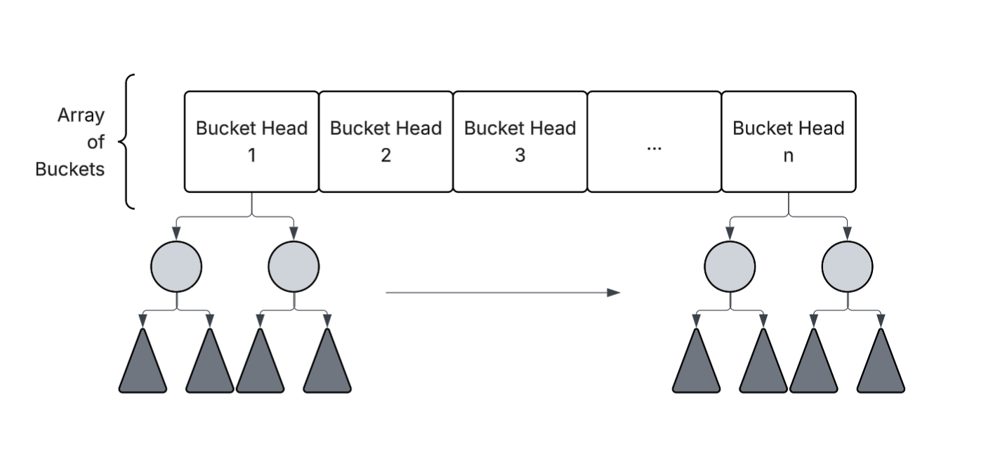
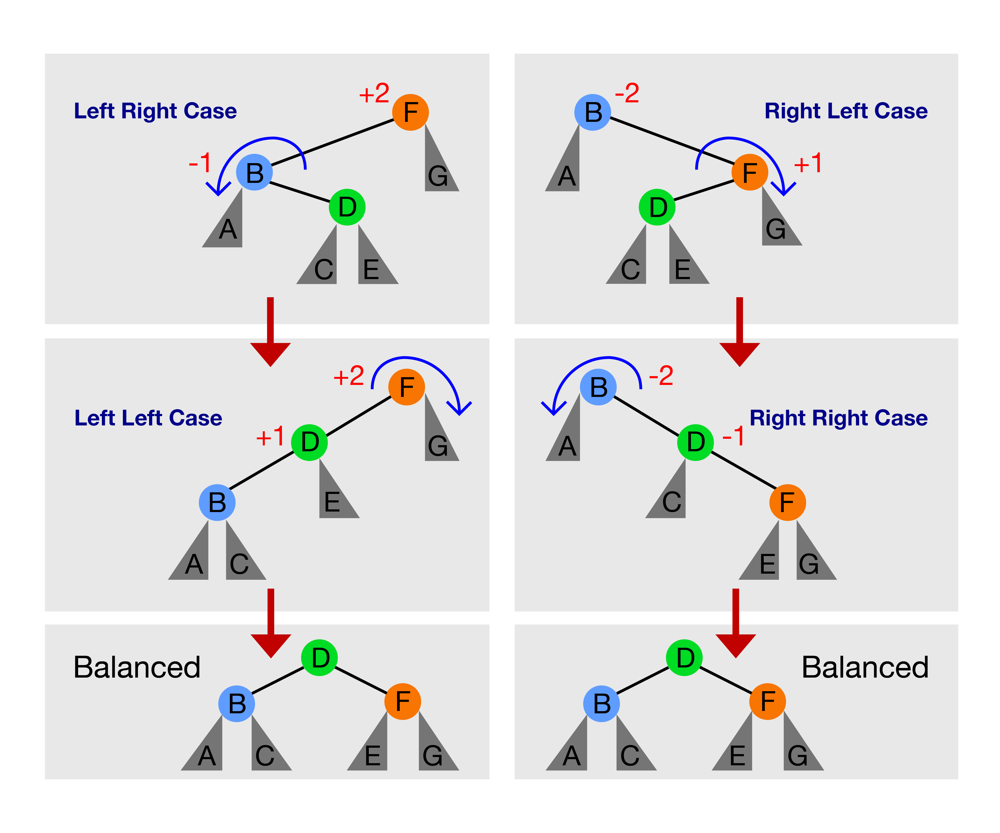

# HashTree
## Abstract
#### “The only thing that grows faster than computer performance is expectation.” – Bjarne Stroustrup.

#### In computer science, new data structures are often adopted rapidly because they promise performance improvements. One of the most widely used is the Hash Map, which excels in average-case efficiency. Its fundamental operations—find, insert, and remove—can all be performed in $O(1)$ time on average, with space complexity $O(n)$. However, its performance suffers in the worst case, degrading to $O(n)$ due to hash collisions.

#### Traditional collision resolution strategies such as open addressing (probing) or separate chaining with linked lists do little to mitigate this issue. Linked lists, in particular, are inefficient for repeated lookups. This raises an important question: what if we could preserve the $O(1)$ average-case behavior of hash maps, but guarantee a better worst-case bound?

#### The idea is to replace the linked list traditionally used in separate chaining with a balanced binary search tree, specifically an AVL tree. This ensures that in the rare event of a collision, the operations degrade only to $O(\log n)$ instead of $O(n)$. In effect, this hybrid approach combines the strengths of hash maps and AVL trees, achieving $O(1)$ average performance with $O(\log n)$ guaranteed in the worst case.

## Related Work: 
#### Java’s HashMap standard library implements collision resolution using linked lists, which were later optimized by replacing them with Red-Black Trees to improve worst-case performance. While Red-Black Trees offer balanced insertion and lookup, they are not strictly height-balanced. In contrast, our design integrates an AVL tree as the collision resolution structure. Since AVL trees maintain stricter balancing than Red-Black Trees, this ensures a tighter bound on tree height and guarantees $O(\log n)$ performance in the worst case for find, insert, and remove operations, while preserving $O(1)$ average-case performance from hashing.

## Design:
#### The data structure hashes element objects into an array of buckets. In the event of a collision (when the mapped element contains the same index of an already existing element represented as the bucket head pointer), each bucket maintains the strict balancing properties of an AVL tree. 

#### The find, insert, and remove operations begin with hashing, yielding $O(1)$ average-case access to the appropriate bucket. When collisions occur, the structure leverages the AVL tree within that bucket, ensuring a strict $O(\log n)$ worst-case bound for subsequent operations. This guarantee arises from the unique balancing mechanism of AVL trees: each node maintains a balance factor, and whenever the factor exceeds $1$ or $-1$, a rotation is performed to restore balance. As a result, the tree’s height is constrained to $O(\log n)$, in contrast to the potential $O(n)$ height of an unbalanced binary search tree. Below are the 4 cases of rotations required for balancing: 

## Complexity Analysis: 
#### Claim 1 (Average Case) : Under uniform hashing bounded by a constant load factor $\alpha$, the HashTree data structure has an expected $O(1)$ time complexity on find, insert, and remove operations.

#### $proof:$ Let $\alpha$ be the load factor calculated by $n$/$m$ where $n$ is the number of elements and $m$ is the number of buckets. This is bounded by a given constant $\alpha$ < 0.75 = $O(1)$ necessary for resizing.
#### 1. By uniform hashing, the expected number of elements in any bucket is $E[k]$ = $\alpha$ = $O(1), where k is the number of elements in the bucket.
#### 2. Each operation first calculates the hash and index of the bucket in $O(1)$.
#### 3. Within each bucket, it contains a balanced tree structure of $O(\log k)$ cost for collision handling. Since $E[k]$ = $O(1)$ given from 1, then we get $O(\log E[k])$ = $O(\log O(1))$ = $O(1)$. 
#### We can now combine 2 and 3 to get an overall expected $O(1)$ time complexity for the find, insert, and remove operations.

#### Claim 2 (Worst Case) : The HashTree data structure guarentree a worst case time complexity of $O(\log n)$ for the find, insert, and remove operations.

#### $proof:$ 

